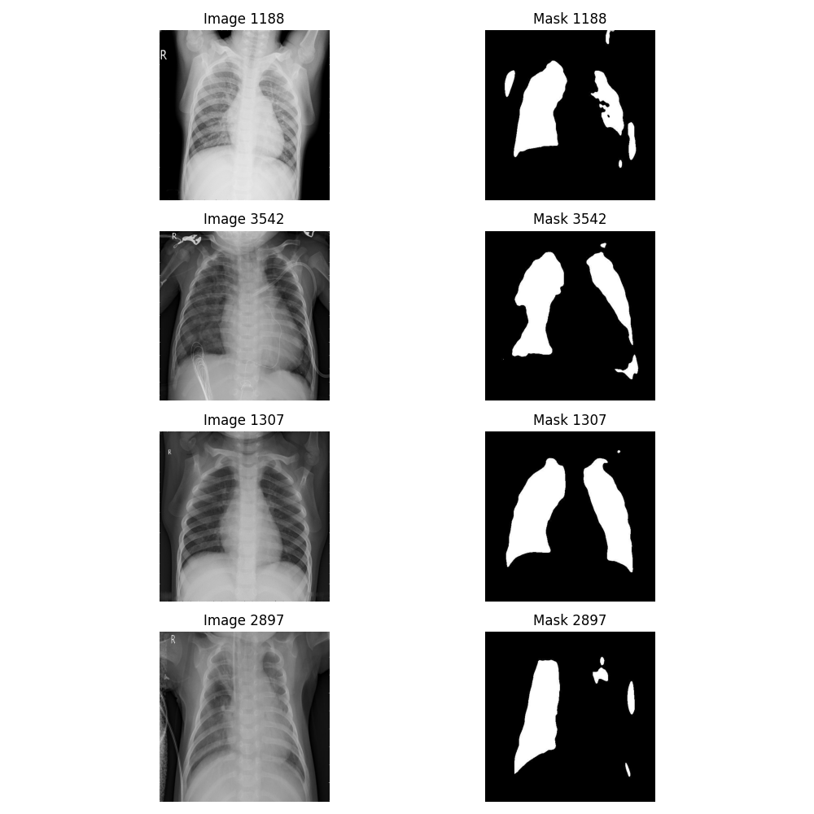
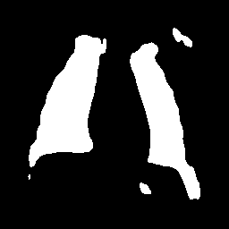
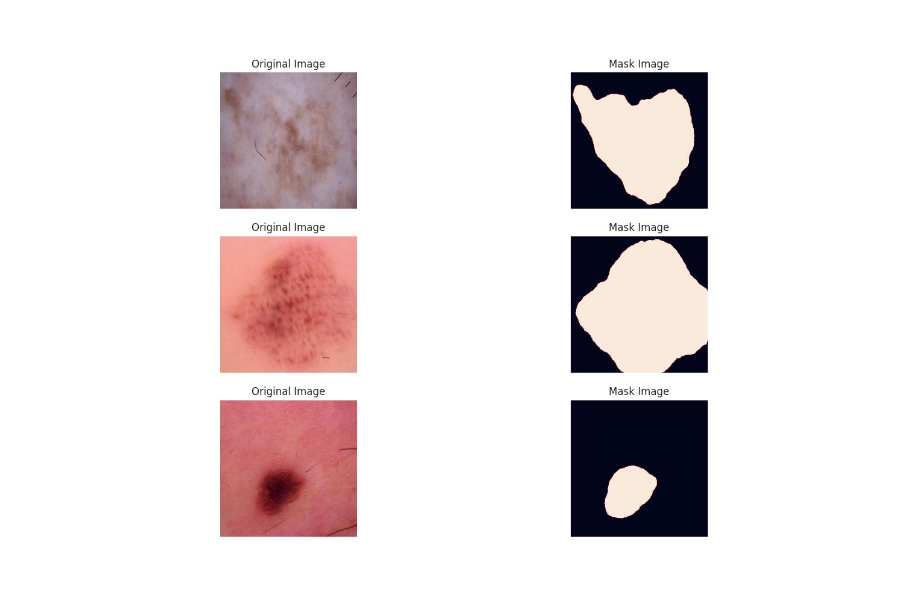
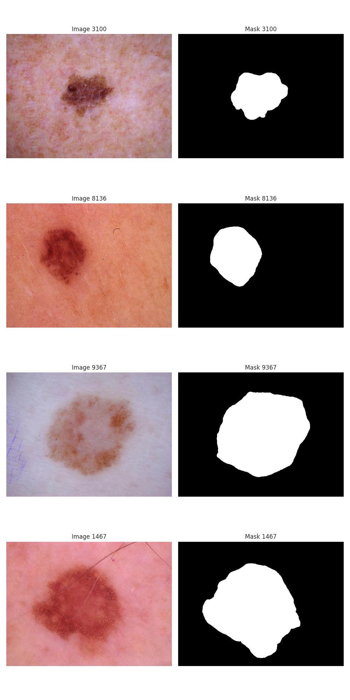
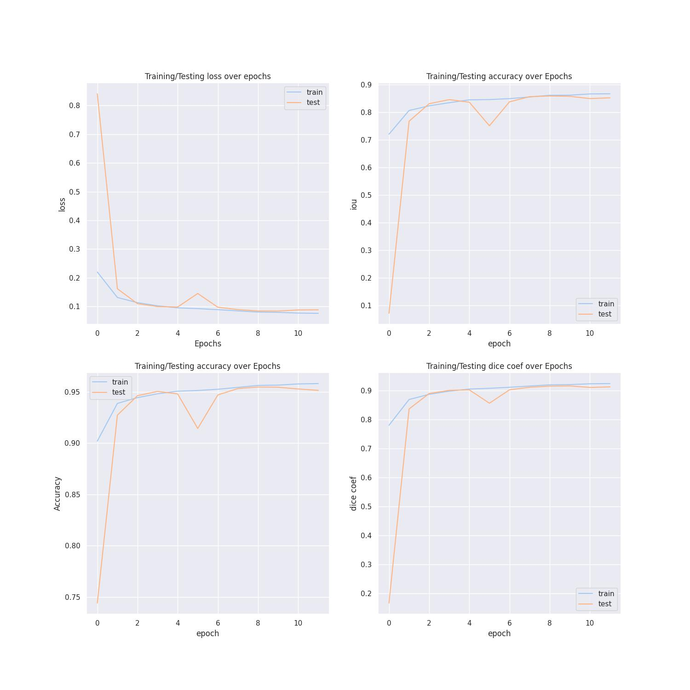

# Hello Users

## It is a Medical Image Segmentation Project

This is a multipurpose project created to solve various medical-related tasks for you.

All the code can be found on my [Github](https://github.com/ShadowAdi/Medical_WebApp_Segmentation).

You can find the notebook files in the [notebooks folder](https://github.com/ShadowAdi/Medical_WebApp_Segmentation/tree/master/notebooks).

You can also find the notebooks in my [Kaggle Notebook](https://www.kaggle.com/shadowadi78).

---

## Chest Segmentation

The model I created is a Chest Segmentation Project.

You will provide an image of your chest, and it will convert it into the segmented image and return it to you.

I created the model using Kaggle. You can find the dataset [here](https://www.kaggle.com/datasets/newra008/chest-segmentation-image).

I created a UNET model from scratch and trained it on the dataset.


*Caption: Mask & Normal Image*

The dataset contains two types of images: normal ones and their segmented (mask) versions. The normal images are in grayscale format, and mask images are either fully black or white.

We also performed preprocessing on our normal and mask images, such as converting the image to grayscale, resizing it to 256x256, and normalizing the pixel values to a range between 0 and 1.

We used a batch size of 32 and ran for 30 epochs with a learning rate of 1e-3, using Adam as the optimizer.

Our model's performance is judged using the following metrics: Accuracy, IoU (Image Over Union), and Dice Coefficient. Our loss function is Dice Loss, which is essentially the negative of Dice Coefficient.

UNET is a powerful model that includes two main parts: a downsampling path and an upsampling path, along with skip connections. We downsample our image using MaxPooling layers and upsample it using Conv2DTranspose layers.

The accuracy score for training images is 94%, Dice Coefficient is 0.96, and IoU is 0.91.


*Caption: Mask Image*

---

## Skin Cancer Segmentation

The model I created is a Skin Cancer Segmentation Project.

You will provide an image of skin cancer, and it will convert it into a segmented image and return it to you.

I created the model using Kaggle. You can find the dataset [here](https://www.kaggle.com/datasets/surajghuwalewala/ham1000-segmentation-and-classification).

I created a UNET model from scratch and trained it on the dataset.

The dataset contains two types of images: normal ones and their segmented (mask) versions. The normal images are in grayscale format, and mask images are either fully black or white.

We also performed preprocessing on our normal and mask images, such as converting the image to grayscale, resizing it to 256x256, and normalizing the pixel values to a range between 0 and 1.

We used a batch size of 32 and ran for 30 epochs with a learning rate of 1e-3, using Adam as the optimizer.

Our model's performance is judged using the following metrics: Accuracy, IoU (Image Over Union), and Dice Coefficient. Our loss function is Dice Loss, which is essentially the negative of Dice Coefficient.

UNET is a powerful model that includes two main parts: a downsampling path and an upsampling path, along with skip connections. We downsample our image using MaxPooling layers and upsample it using Conv2DTranspose layers.


*Caption: Mask Image*


*Caption: Mask Image*


*Caption: Results Image*

---

## MediBot

I created a Medical Bot for you, so you can chat with it to get information related to healthcare.

---

## How to Set Up and Use the Project

### Prerequisites

1. **Python**: Ensure you have Python 3.6 or higher installed on your system.

2. **Git**: Make sure Git is installed to clone the repository.

### Setting Up the Environment

1. **Clone the Repository**:
   ```bash
   git clone https://github.com/ShadowAdi/Medical_WebApp_Segmentation.git
   cd Medical_WebApp_Segmentation
2. **Create A Virtual Enviroment**
   python -m venv venv
3. **Activate the Virtual Environment:**
    * On Windows:
    ```bash
      venv\Scripts\activate

4. Install Dependencies:
   ```bash
   pip install -r requirements.txt


